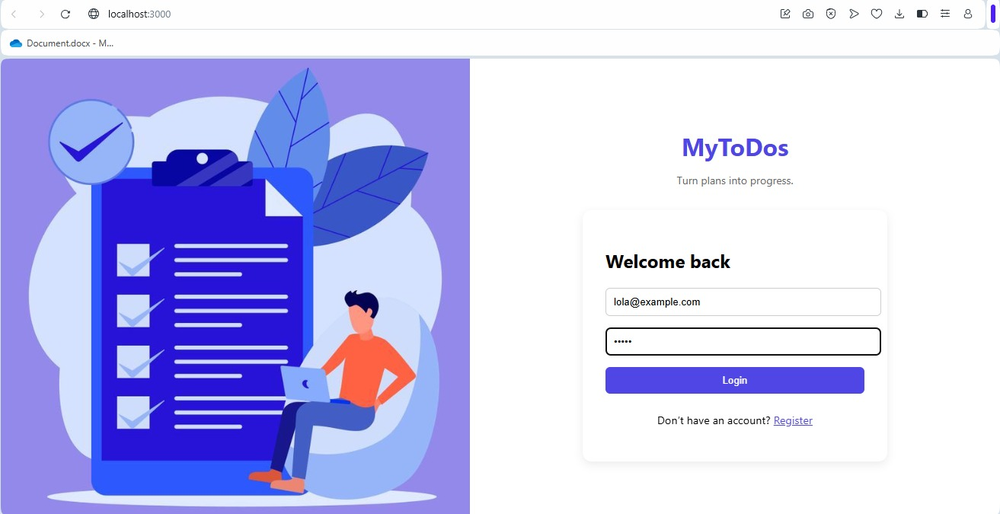
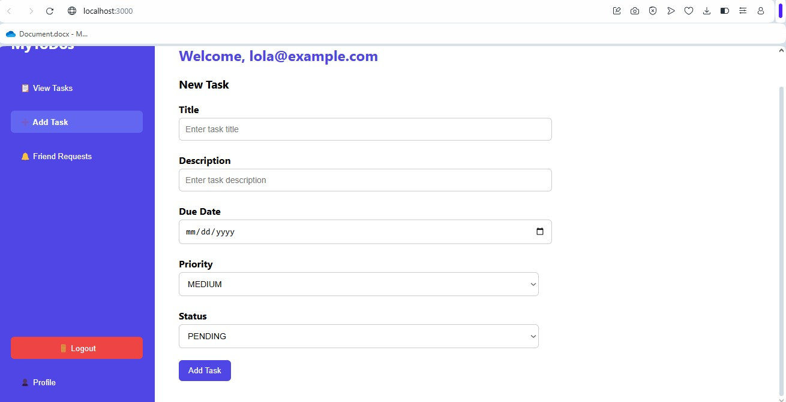
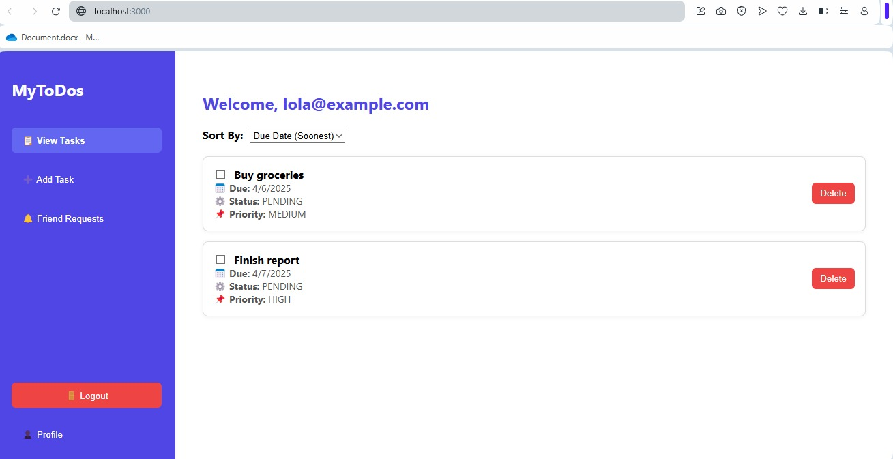
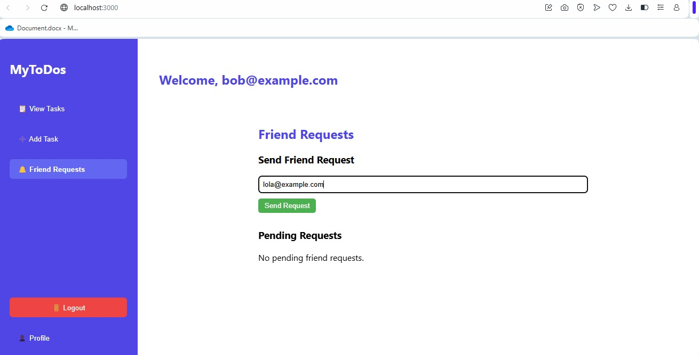
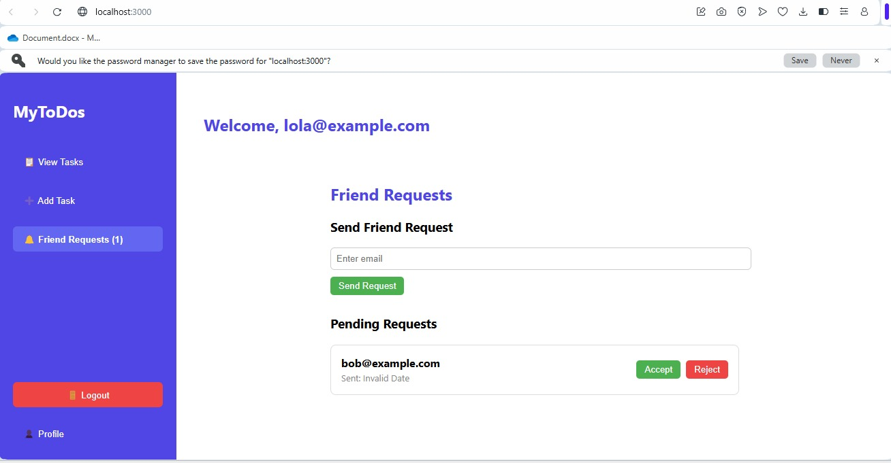
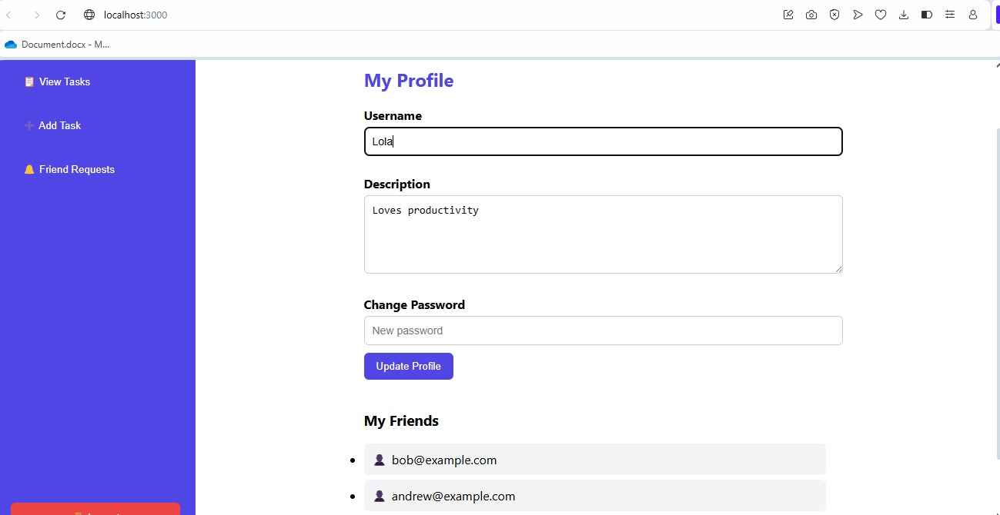

# 📋 MyToDos

A full-stack task management app that lets users manage their tasks, connect with friends, send/accept friend requests, and customize their profiles.

## 🚀 Features

- ✅ Register / Login system
- 🗂️ Create, update, and delete tasks
- 📅 Sort tasks by due date or priority
- 🔔 Friend system (send, accept, reject requests)
- 👥 View and manage friends
- 👤 User profile with username, description, and password editing
- 📬 Notifications for pending friend requests

---

## 🧑‍💻 Tech Stack

**Frontend**: React  
**Backend**: Spring Boot (Java)  
**Database**: PostgreSQL  
**Styling**: Inline CSS + Flexbox  
**ORM**: Spring Data JPA

---

## 🖼️ Screenshots

### 🔐 Login & Register


---

### 📝 Add Task


---

### 🧾 View Tasks


---

### 🤝 Send Friend Request


---

### 🛎️ Receive Friend Request


---

### 👤 My Profile


---

## 🛠️ Setup Instructions

### 1. Backend

1. Clone the repo
2. Set up PostgreSQL database
3. Configure `application.properties` with your DB credentials:
    ```properties
    spring.datasource.url=jdbc:postgresql://localhost:5432/mytodos
    spring.datasource.username=your_username
    spring.datasource.password=your_password
    ```
4. Run the Spring Boot app (`TaskManagerApplication`)

---

### 2. Frontend

```bash
cd frontend
npm install
npm start
